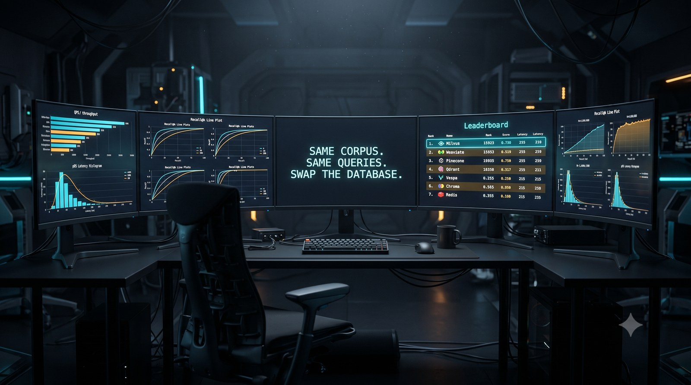

# rag-retriever-bench

[](https://github.com/kenimo49/rag-retriever-bench/actions/workflows/ci.yml)
[](https://www.python.org/downloads/)
[](LICENSE)



Benchmark harness for RAG retrieval backends: **same corpus, same queries, same metrics — swap the database.**

Most RAG evaluation tools score the *answers* (ragas, DeepEval) or the *embedding models* (MTEB, JMTEB). This one scores the layer in between: the **retrieval backend**. It answers questions like *"at my corpus size and query pattern, is pgvector enough, or do I need something else?"* — with measured numbers instead of vendor benchmarks.

## What it measures

| Dimension | Metrics |
|---|---|
| Retrieval quality | recall@k, hit@k, MRR@k, nDCG@k (binary qrels, no LLM judge) |
| Query latency | p50 / p95 / p99 / mean (ms, client-side) |
| Ingestion | bulk load seconds, index build seconds |

All metrics are deterministic. No LLM-as-judge anywhere, so runs are cheap and reproducible.

## Backends (v0.1)

| Backend | Type | Index |
|---|---|---|
| **pgvector** (PostgreSQL) | server | HNSW |
| **ClickHouse** | server | `vector_similarity` HNSW (two `index_granularity` variants) + brute-force full scan |
| **Qdrant** | server | HNSW (gRPC loading) |
| **Weaviate** | server | HNSW |
| **Milvus** (standalone) | server | HNSW |
| **Chroma** | embedded | HNSW |
| **LanceDB** | embedded | IVF_HNSW_SQ (8-bit scalar quantization — not flat HNSW) |

Backends implement a small interface (`retrievers/base.py`); adding one is a single file — see [docs/adding-a-backend.md](docs/adding-a-backend.md).
Server backends need `pip install -e ".[all]"` (or the per-backend extra) and `docker compose up`.

Every run records a `self_check` per backend — an EXPLAIN or server-statistics probe that
verifies the ANN index was actually used. Three of the backends above shipped a way to
silently degrade to full scan with zero errors; the harness caught all three.

## Quick start

```bash
git clone https://github.com/kenimo49/rag-retriever-bench
cd rag-retriever-bench
pip install -e ".[all]"       # or just `pip install -e .` for pgvector/ClickHouse only

docker compose up -d          # pgvector, ClickHouse, Qdrant, Weaviate, Milvus (Chroma/LanceDB are embedded)
cp .env.example .env          # set OPENAI_API_KEY (used for embeddings)

# 10k-passage smoke run (MIRACL-ja downloads on first use)
rag-retriever-bench run -c configs/miracl-ja.yaml --corpus-size 10000

# full 100k run
rag-retriever-bench run -c configs/miracl-ja.yaml
```

Reports land in `results/` as Markdown + JSONL. Every server-backend row includes recall / nDCG / MRR / hit@k and p50/p95/p99 latency; a companion `self_check` block per backend records the EXPLAIN or server-statistics probe that confirms the ANN index was actually used.

## Sample output

Excerpt from a 100k-passage MIRACL-ja run ([full report](results/published/miracl-ja-100000-20260711T053605Z.md)):

| backend | recall@10 | ndcg@10 | p50 (ms) | p95 (ms) | p99 (ms) | load (s) | index (s) |
|---|---|---|---|---|---|---|---|
| pgvector (HNSW) | 0.936 | 0.878 | 4.8 | 6.1 | 6.4 | 31.6 | 24.1 |
| ClickHouse (HNSW) | 0.923 | 0.866 | 43.1 | 51.5 | 59.9 | 12.7 | 7.7 |
| ClickHouse (HNSW, g=128) | 0.921 | 0.866 | 11.5 | 13.1 | 15.7 | 10.9 | 8.1 |
| ClickHouse (brute force) | 0.952 | 0.891 | 65.9 | 86.7 | 114.2 | 9.1 | 1.2 |
| Qdrant (HNSW) | 0.947 | 0.888 | 3.3 | 4.1 | 4.6 | 18.0 | 1.0 |
| Weaviate (HNSW) | 0.929 | 0.873 | 1.8 | 2.1 | 2.5 | 31.6 | 0.0 |
| Milvus (HNSW) | 0.940 | 0.882 | 2.0 | 2.3 | 2.7 | 10.0 | 16.9 |

Embeddings: `text-embedding-3-small` (dim=1536), 860 queries, top_k=10. All HNSW backends aligned at `m=16, ef_construction=64, ef_search=100`, cosine distance.

## Dataset

Default config uses [MIRACL](https://huggingface.co/datasets/miracl/miracl) (ja): Japanese Wikipedia passages with human-annotated relevance judgments. The sampled corpus always contains every positive passage for the query set, so recall is measured against complete ground truth. Embeddings (`text-embedding-3-small`) are cached locally — a 100k-passage corpus costs roughly $0.30 to embed, once.

## Design notes

- The harness never assumes a winner. Index parameters (HNSW m / ef) are aligned across backends so differences reflect the engine, not the tuning.
- Latency is measured client-side per query, including serialization. Server backends all pay the same localhost network hop; embedded backends (Chroma, LanceDB) run in-process and are reported in a separate table — do not compare the two classes directly.
- recall@k is the standard uncapped definition (hits / |positives|); duplicate docids returned by a backend are deduplicated before scoring.
- `corpus_size` is a CLI flag so you can sweep scale (10k → 100k → …) and find where the trade-offs actually flip, on your own hardware.

Full write-up: [docs/methodology.md](docs/methodology.md).

## Testing

```bash
pip install -e ".[dev,all]"
pytest                        # unit + e2e tests, no services needed
docker compose up -d --wait   # start all 5 server backends
pytest -m integration         # live contract tests against every backend
```

Integration tests skip per-backend when a service isn't reachable, use an
`rrb_it_*` table/collection namespace (your bench data is never touched), and
verify results against a numpy brute-force ground truth. If the services run
on another machine, point the tests at it with `RRB_IT_HOST=<host>`.

## Roadmap

- v0.2: metadata-filtered search, hybrid (vector + full-text) mode, more backends
- Synthetic QA generation for bring-your-own-corpus evaluation

## License

MIT
